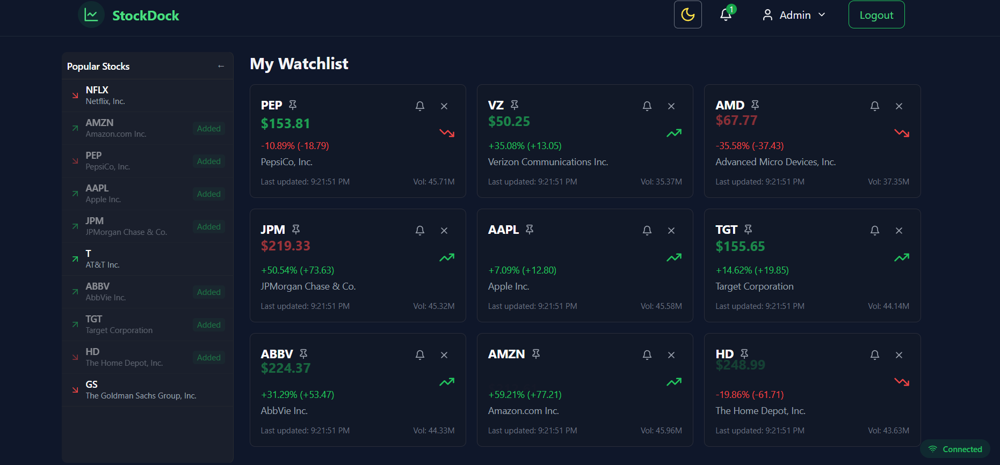
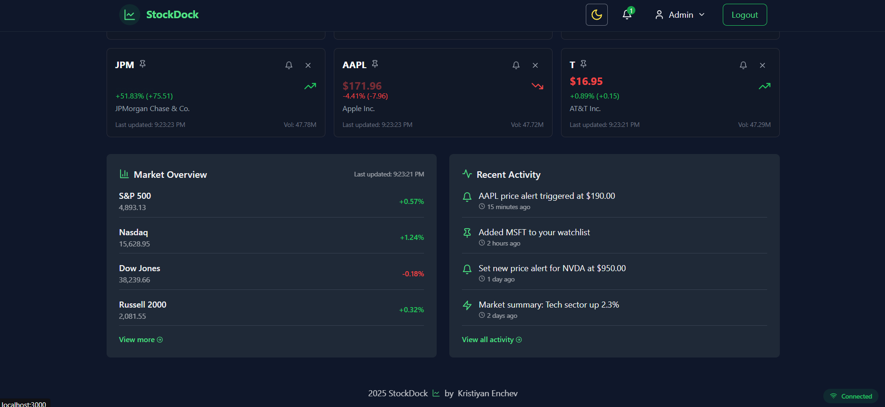

# StockDock 📈

## 🏗️ Overview

**StockDock** is a comprehensive stock tracking and analysis application built with **.NET 9** and **React 18 (Vite + TypeScript)**, leveraging **Clean Architecture**, **DDD**, **CQRS with MediatR**, and modern frontend technologies. The application allows users to track stock prices, set alerts, view historical data, and manage their watchlists.

The backend is built on a solid foundation of **Clean Architecture** with clearly separated layers (Domain, Application, Infrastructure, and API), while the frontend utilizes **React 18** with **TypeScript**, **Redux Toolkit**, **RTK Query**, and **shadcn/ui** components for a sleek and responsive user experience.

Stock data is sourced from **Alpha Vantage API** (with a demo mode available), providing real-time and historical stock information.

---

<p align="center" style="display: flex; justify-content: space-between; align-items: center;">
    
    
</p>

---

## 👀 Try it out

To run the project locally:

```bash
git clone https://github.com/KristiyanEnchev/StockDock.git
```

```bash
cd StockDock/
```

```bash
cp .env.example .env
```

If you want to use the Alpha Vantage API instead of the demo mode, update the `.env` file with your API key:
```
USE_DEMO=false
API_KEY="your-alpha-vantage-api-key"
```

Start the application with Docker:
```bash
docker-compose up --build -d
```

---

## 🔠 Configuration

- **Default Account**: Email: admin@admin.com, Password: 123456
- **Database**: PostgreSQL. DB UI - `http://localhost:5050` - Acc: **admin** - Pass: **password**
- **Cache**: Redis is used for caching with master-slave replication. Redis UI - `http://localhost:8081`
- **API URL**: `http://localhost:8080`
- **UI URL**: `http://localhost:3000`

---

## 🔧 Built with

### Backend:

- [.NET 9](https://dotnet.microsoft.com/)
- [CQRS & MediatR](https://github.com/jbogard/MediatR) for command/query separation
- [FluentValidation](https://github.com/FluentValidation/FluentValidation) for request validation
- [Domain Events](https://www.martinfowler.com/eaaDev/DomainEvent.html) for decoupled domain logic
- [Repository Pattern](https://martinfowler.com/eaaCatalog/repository.html) for data access abstraction
- [SignalR](https://dotnet.microsoft.com/en-us/apps/aspnet/signalr) for real-time updates
- [Redis](https://redis.io/) for distributed caching with master-slave replication
- [PostgreSQL](https://www.postgresql.org/) as the relational database
- **Background Services** for handling scheduled tasks and alerts

### Frontend:

- [React 18](https://reactjs.org/)
- [Vite](https://vitejs.dev/) for lightning-fast development
- [TypeScript](https://www.typescriptlang.org/) for type safety
- [Redux Toolkit](https://redux-toolkit.js.org/) for state management
- [RTK Query](https://redux-toolkit.js.org/rtk-query/overview) for API data fetching
- [TailwindCSS](https://tailwindcss.com/) for styling
- [shadcn/ui](https://ui.shadcn.com/) for UI components
- [Framer Motion](https://www.framer.com/motion/) for animations
- [Recharts](https://recharts.org/) for stock charts and data visualization
- [React Hook Form](https://react-hook-form.com/) with [Zod](https://github.com/colinhacks/zod) for form validation
- [SignalR Client](https://docs.microsoft.com/en-us/aspnet/core/signalr/javascript-client) for real-time updates

### DevOps:

- **Docker & Docker Compose**: For containerization and orchestration
- **Redis Master-Slave Replication**: For high availability caching

---

## 📚 Features

- **Stock Search**: Search and discover stocks by symbol or company name
- **Real-Time Price Updates**: Get the latest stock prices with real-time updates
- **Historical Data**: View historical stock price data with interactive charts
- **Watchlists**: Create and manage personal watchlists of favorite stocks
- **Alerts**: Set price alerts to get notified when stocks reach desired price points
- **Responsive Design**: Seamless experience across desktop and mobile devices
- **High Performance**: Leveraging Redis caching for improved performance
- **Real-Time Updates**: Using SignalR for instant price updates and notifications
- **Offline Support**: Progressive Web App capabilities for offline access

---

## ✏️ License

This project is licensed under the MIT License - see the [LICENSE](LICENSE) file for details.

---

## 👨‍💻 Show your support

Give a ⭐ if you like this project and find it helpful!

---

## 🧏‍♂️️ Author

[](https://www.facebook.com/kristiqn.enchev.5/) [](https://www.instagram.com/kristiyan_e/) [](mailto:kristiqnenchevv@gmail.com)
